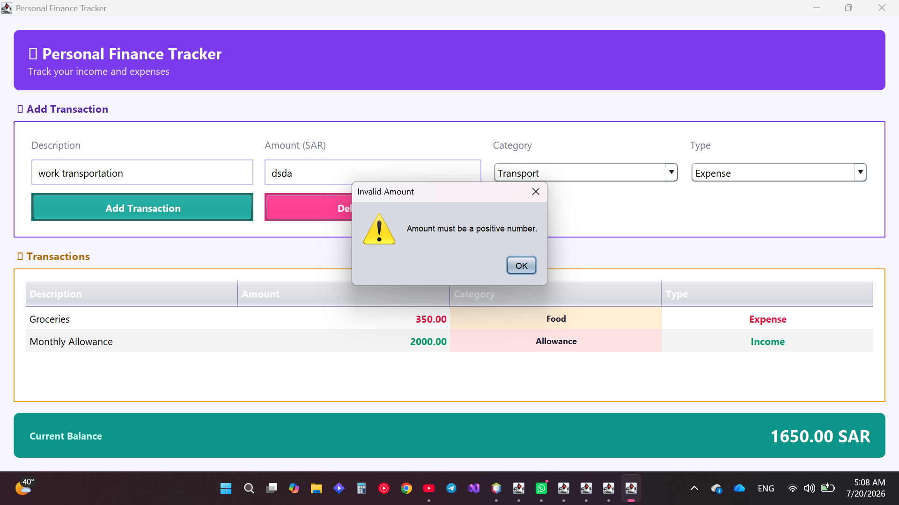

# 💰 Personal Finance Tracker

A desktop application built with **Java Swing** to track personal income and expenses, with real-time balance calculation and local data persistence.

## Features

- **Add transactions** — record income or expenses with description, amount, and category
- **Real-time balance** — automatically calculates and updates your current balance
- **Category tracking** — organize transactions by category (Food, Transport, Education, Shopping, Salary, Allowance, Other)
- **Color-coded UI** — income shown in green, expenses in red, categories color-coded for quick scanning
- **Data persistence** — transactions are saved locally to a CSV file and reloaded automatically on startup
- **Delete transactions** — remove any entry directly from the table
- **Input validation** — prevents empty fields and invalid (non-numeric or negative) amounts

## Screenshots

**Main interface**

**Adding an expense**

**Adding income and viewing updated balance**

**Input validation — missing fields**

**Input validation — no row selected for deletion**

**Transaction table view**

**Input validation — invalid amount**

## Tech Stack

- **Language:** Java
- **UI Framework:** Java Swing (GridBagLayout, JTable, custom cell renderers)
- **Data Storage:** Local CSV file (no external database required)
- **IDE:** NetBeans

## How It Works

1. Enter a transaction description and amount
2. Select a category and type (Income / Expense)
3. Click **Add Transaction** — it appears instantly in the table below
4. The **Current Balance** updates automatically, color-coded green (positive) or red (negative)
5. Select any row and click **Delete Selected** to remove it
6. All data is saved to `transactions.csv` and reloaded automatically the next time the app runs

## What I Learned

Building this project helped me apply core object-oriented programming concepts in a practical desktop application, including:
- Structuring a GUI application with clear separation between UI components and business logic
- Working with Java Swing layout managers (`GridBagLayout`, `BorderLayout`) to build a responsive interface
- Implementing custom table cell renderers for dynamic, data-driven styling
- Handling file I/O for simple local data persistence
- Writing basic input validation and user feedback (dialogs) for a smoother user experience

## Author

**Raseel Al-Shahrani**
Computer Science Student, Princess Nourah Bint Abdulrahman University

